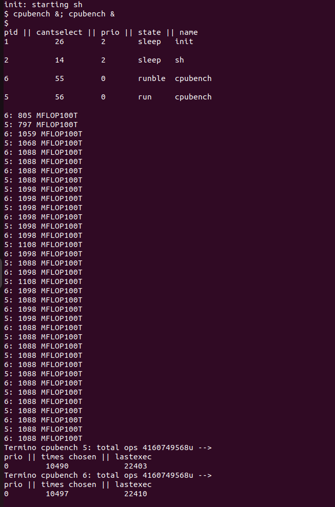
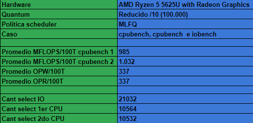

# Primer parte
Estudiando el planificador de xv6-riscv y respondiendo preguntas. Comenzaremos este laboratorio leyendo código
para entender cómo funciona la planificación en xv6-riscv:

- Analizar el código del planificador y responda en el informe:

1. ¿Qué política de planificación utiliza xv6-riscv para elegir el próximo pro-
ceso a ejecutarse? Pista: xv6-riscv nunca sale de la función scheduler
por medios “normales”.

En el sistema operativo xv6, las funciones sched()  y  scheduler() se comunican con la función swtch() para realizar el cambio de contexto entre procesos. Aquí se explica cómo se relacionan:

sched(): La función sched() es la que llama a  swtch() para realizar el cambio de contexto. Cuando sched() decide que un proceso diferente debe ejecutarse (por ejemplo, después de que un proceso haya llamado a  yield() o una interrupción de temporizador haya activado la conmutación de contexto), llama a swtch() para efectuar el cambio.

scheduler(): La función scheduler() es la que selecciona qué proceso se ejecutará a continuación. Cuando decide qué proceso debe ejecutarse, cambia el estado de ese proceso a RUNNING y luego llama a sched() para que realice el cambio de contexto al proceso seleccionado. Esto permite que el proceso seleccionado comience su ejecución.

swtch(): La función swtch() se encarga del cambio de contexto real. Toma dos contextos como argumentos: el contexto del proceso que está en ejecución y el contexto del proceso que se debe ejecutar a continuación. swtch() guarda el estado del proceso actual y carga el estado del nuevo proceso. Esto incluye el contenido de los registros, la pila y otros datos necesarios para que el proceso continúe su ejecución desde donde se detuvo. Una vez que se ha realizado el cambio de contexto, swtch() regresa al contexto del proceso original (pero con un proceso diferente) y la ejecución continúa desde donde se dejó.

Entonces, en resumen, sched() y scheduler() toman decisiones sobre cuál proceso debe ejecutarse a continuación y cuándo se debe realizar el cambio de contexto, mientras que swtch() se encarga del cambio real de contexto, guardando y restaurando el estado del proceso adecuadamente para permitir que los procesos compartan la CPU en un sistema multitarea. Estas funciones trabajan en conjunto para lograr la planificación y el cambio de contexto en xv6.

Ademas timerinit() en el sistema operativo xv6 se encarga de inicializar y configurar el temporizador y las interrupciones de temporizador en el sistema y ahi se establece el valor del quantum.

Bajo todos estos datos podemos deducir que la política del sistema es Round Robin.

2. ¿Cuánto dura un quantum en xv6-riscv?
Al rededor de 1/10 segundos según la función timerinit().

3. ¿Cuánto dura un cambio de contexto en xv6-riscv?
Basados en que el cambio de contexto esta incluido en el quantum
nos planteamos una hipotesis que fue: si achicamos lo suficiente el quantum  como para que no alcance a mostrarse la consola, entonces eso seria lo que dura el cambio de contexto, y así fue, el valor al que nos pudimos aproximar fue de 400. 

4. ¿El cambio de contexto consume tiempo de un quantum?
Basados en el ejercicio 3, sí, el cambio de contexto esta incluido en el quantum.

5. ¿Hay alguna forma de que a un proceso se le asigne menos tiempo? Pista:
Se puede empezar a buscar desde la system call uptime.
La syscall sys_uptime se encarga de obtener la cantidad de ticks que han transcurrido desde que el sistema se inició.  En particular, en la variable  xticks se guarda el valor del tiempo transcurrido en el sistema, pero hace un aquire para evitar que otros procesos entren en esta región crítica. Luego, se libera el lock permitiendo a otros porcesos acceder a ese valor de tic.
En conclusión, otro proceso puede usar el valor del tiempo que queda del quantum del proceso anterior, si el anterior se bloqueó por alguna razón. Sin embargo, cuando el quantum se complete, el proceso que ocupó lo que le quedaba del anterior va a ser interrumpido ya que completo el valor del quantum, de esta forma un proceso recibió menos tiempo en el cpu. 

6. ¿Cúales son los estados en los que un proceso pueden permanecer en xv6-riscv y que los hace cambiar de estado?
En el archivo proc.h se establecen los estados posibles de un proceso:
enum procstate {UNUSED, USED, SLEEPING, RUNNABLE, RUNNING, ZOMBIE};
Estos son los estados para un proceso en xv6.

***

# Segunda Parte

- objetivos: Contabilizar las veces que es elegido un proceso por
el planificador y analizar cómo el planificador afecta a los procesos.
 
 1. Mida la respuesta de I/O y el poder de cómputo obtenido durante 3 minutos para los siguiente Casos y grafique los resultados obtenidos en el informe

### Caso 1:

1 iobench solo. En este caso queremos investigar como se
comporta un solo proceso iobench corriendo solo (sin otros procesos en
paralelo) en xv6-riscv. A partir de las métricas obtenidas describir este
escenario.

En este caso, presionamos ctrl+p para ver la tabla de procesos que se estaban ejecutando; en ella se muestran 2 procesos extras, además del iobench que pusimos a ejecutar con los siguientes datos: pid del proceso, el estado en el que se encuentra, nombre del proceso, cantidad de veces que fue elegido y la última vez elegido. Además, esos otros 2 porcesos corresponden a:

- init:
Es uno de los procesos principales y el primero en ejecutarse cuando se inicia el sistema. Su función principal es inicializar el sistema operativo y configurar el entorno en el que se ejecutarán otros procesos y servicios.

- Sh:
Ss la consola shell que esta abierta.

A la derecha se muestran las operaciones de escritura y lectura que esta realizando el proceso 3, o sea, el iobench cada 100 ticks. Al final se muestra que terminó el iobench, la cantidad de operaciones que hizo, cantidad de veces que fue elegido, la ultima vez que fue elegido, el nombre del proceso y el pid del proceso para corroborar que se esta devolviendo los datos del proceso iobench correspondiente.

En cuanto a la cantidad de operaciones de escritura y de lectura, son todas mas o menos las mismas, ya que, en teoría, le estoy asignando a cada vez que se ejecuta el proceso el mismo quantum, no son exactamente iguales, ya que el cpu no tiene un comportamiento ideal, o sea, no funciona siempre a la misma velocidad, lo cual hace que a veces realice más operaciones de lectura y escritura, o menos, en algunos casos.

---

### Caso 2:
1 cpubench solo. En este caso queremos investigar como se
comporta un solo proceso cpubench corriendo solo (sin otros procesos en
paralelo) en xv6-riscv. Apartir de las métricas obtenidas describir este
escenario.

En la siguiente imagen tambien se muestra la tabla de procesos. Y, al final, tambien se muestran los datos del proceso cpubench. Aqui tambien, a la derecha de la imagen, se ve la cantidad en Millones de operaciones de punto flotante en 100 ticks del cpubench. Se observó que tardó mucho más en terminar el cpubench que el iobench, por eso el espacio que hay en una de las lineas; pensamos que se había trabado. Tambien la cantidad de veces que fue elegido es menor.

Basados en estos dos casos vamos a armar una **_Hipótesis:_ el Iobench, como esta realizando operaciones de lectura y escritura, pasa a estar en el estado bloqueado o en espera, por eso la cantidad de veces que es elegido es mayor que la del cpubench, ya que este último solo se corta cuando se le acaba el quantum. El iobench pasa a desocupar el cpu. Luego, el cpubench va a pasar a usar el cpu con el tiempo del quantum que le quedo disponible al iobench y, de esta forma, el cpubench se queda con menos de un quantum.**

---

### Caso 3:
1 iobench con 1 cpubench. En este caso queremos investigar
como se comporta un solo proceso iobench corriendo cuando además esta
corriendo otro poceso cpubench en paralelo en xv6-riscv. Apartir de las métricas obtenidas describir este escenario. En este mismo Caso podemos
ver como se comporta 1 cpubench cuando en paralelo corre 1 iobench.

Observando los tics cuidadosamente, al pricncipio se ve la cantidad de operaciones de punto flotante cada 100 tics del cpubench, o sea, que si no se muestra otra vez esta información, entonces es porque el proceso no llego a los 100 tics. Luego se ejecuta 100 tics el iobench, dejando disponible 200 tics aproximadamente para que se cumpla el quantum, entra devuelta el cpubench y ¿Qué pasó? Sólo se ejecutó 200 tics, se cumple nuestra hipótesis.
Además, tenemos como dato adicional para reforzar la idea de que el iobench pasa a estado bloqueado viendo la cantidad de veces que fue elegido respecto de la cantidad de veces que fue elegido el cpubench.

---

### Caso 4: 
1 cpubench con 1 cpubench. En este caso queremos investigar
como se comporta un solo proceso cpubench corriendo cuando además esta
corriendo otro pocesos cpubench en paralelo en xv6-riscv. Apartir de las métricas obtenidas describir este escenario.

Como Hipotesis vamos a plantear lo siguiente: al haber 2 cpubench ambos van a ser elegidos la misma cantidad de veces y van a hacer la misma cantidad de operaciones, ya que cada uno va a ocupar el cpu durante todo el quantum (despreciando el cambio de contexto). Además, como va tener que elegir entre dos procesos en base a la cantidad de veces que fue elegido, va a pasar lo siguiente, siendo A y B dos procesos cpubench:
A,B,B,A,A,B,B,A,A. Y asi sucesivamente hasta que terminen. Esto se debe a que cuando los dos ya se han ejecutado la misma cantidad de veces va a elegir el que ya esta en el núcleo/hilo para así ahorrarse el cambio de contexto.

---
### Caso 5:
1 cpubench con 1 cpubench e iobench. En este caso queremos investigar como se comporta un solo proceso cpubench corriendo cuando además está corriendo otro pocesos cpubench e iobench en paralelo en xv6-riscv. Apartir de las métricas obtenidas describir este escenario.

En este caso podemos apreciar que la cantidad de veces que se selecciona un proceso es aproximadamente la misma (con iobench teniendo una ligera ventaja) esto sucede por el scheduler de round robin en el cual se elige cada proceso de manera equitativa y en orden. A diferencia del caso de iobench individual, podemos ver como en este el iobench tiene muchas menos operaciones, esto es ya que el iobench se tiene a ejecutar por pocos periodos de tiempo. Sin embargo, cada proceso se devuelve al final de la "cola" sin importar cuanto del quantum se haya utilizado, por tanto tiene que esperar al siguiente cpubench.
En resumen: RR desfavorece el iobench por que lo hace esperar tambien al cpubench.

2. Repita el experimento para quantums 10 veces más cortos:

### Caso 1:
1 iobench solo. En este caso queremos investigar como se comporta un único proceso iobench corriendo solo (sin otros procesos en paralelo) en xv6-riscv. A partir de las métricas obtenidas describir este escenario.

Cuando se reduce el quantum, cada proceso tiene menos tiempo para ser ejecutado, esto lleva a que se realicen mas cambios de contexto. Sin embargo, los resultados se ven muy similares a los originales. En este caso podemos sacar como conclusión que iobench, al realizar solicitudes de I/O que requieren esperar a que los dispositivos de I/O completen sus operaciones, pueden hacer que iobench ceda la CPU voluntariamente mientras espera que finalicen las operaciones de E/S. La frecuencia en la que se selecciona puede permanecer relativamente estable porque generalmente está en un estado de espera y el tiempo que pasa activamente usando la CPU puede ser significativamente corto.

---

### Caso 2:
1 cpubench solo. En este caso queremos investigar como se comporta un único proceso cpubench corriendo solo (sin otros procesos en paralelo) en xv6-riscv. Apartir de las métricas obtenidas describir este escenario.

Como dijimos en el caso anterior, cuando se reduce el quantum, cada proceso tiene menos tiempo para ser ejecutado, esto lleva a que se realicen más cambios de contexto. En este caso, vemos que, a diferencia del iobench, si hubo un cambio significativo tanto en la cantidad de operaciones (menor cantidad) y la cantidad de selecciones (mayor cantidad). Podemos tomar como conclusión que cpubench se interrumpe con más frecuencia, lo que resulta en menos tiempo dedicado al número de operaciones reales; los quantums más cortos también pueden dar lugar a una preferencia más frecuente durante las secciones críticas del código, lo que dificulta que un proceso como cpubench logre avances significativos en sus operaciones.

---

### Caso 3:
1 iobench con 1 cpubench. En este caso queremos investigar como se comporta un único proceso iobench corriendo cuando además esta corriendo otro poceso cpubench en paralelo en xv6-riscv. Apartir de las métricas obtenidas describir este escenario. En este mismo caso podemos ver como se comporta 1 cpubench cuando en paralelo corre 1 iobench.

En este caso, comparandolo con su contraparte con el quantum original, nos damos cuenta que no sólo cada proceso se elige más veces (como ya vimos, esto es sencillo de explicar, simplemente se hacen mas cambios de contexto), sino que el iobench tiene más operaciones y el cpubench menos. Podemos tomar como conclusión que, al tener quantums más chicos y poder cambiar entre procesos más rapidamente, iobench tiene más chances de ser elegido cuando está runnable y poder realizar más operaciones; en cambio, cpubench tiene menos chances de hacer computo, ya que tiene menos quantum disponible (recordemos que cpubench hace operaciones constantemente).

---

### Caso 4:
1 cpubench con 1 cpubench. En este caso queremos investigar como se comporta un solo proceso cpubench corriendo cuando además esta corriendo otro poceso cpubench en paralelo en xv6-riscv. Apartir de las métricas obtenidas describir este escenario.

Aquí podemos ver que, a diferencia de su contraparte con el quantum original, la cantidad de selecciones es mucho mayor (10 veces mayor, que va de la mano con la reduccion del quantum), pero que, a su vez, la cantidad de operaciones puede parecer muy similar. Como conclusión podemos sacar que, a pesar de la diferencia de quantum, estos procesos siguen haciendo computo todo el tiempo, por tanto, aprovechan cada tiempo que están corriendo al máximo. La diferencia entre la cantidad de operaciones puede ser explicada por los cambios de contexto, de los cuales se realizan muchos, y que el consumo de tiempo, aunque poco individualmente, en conjunto puede resultar en una diferencia notoria.

---

### Caso 5:
1 cpubench con 1 cpubench e iobench. En este caso queremos investigar como se comporta un solo proceso cpubench corriendo cuando además esta corriendo otro pocesos cpubench e iobench en paralelo en xv6-riscv. A partir de las métricas obtenidas describir este escenario.

Nuevamente podemos ver diferencias muy notorias, entre ellas la que ya nos acostumbramos con los anteriores experimentos: al estar el quantum reducido, la cantidad de veces que se selecciona cada proceso es 10 veces mayor. Otra diferencia es que cada cpubench realizó menos operaciones, mientras que el iobench realizo muchisimas más. Esto es similar al experimento con un iobench y cpubench, en el cual se explica que, al tener un quantum reducido, se puede cambiar entre procesos mas rapidamente, teniendo la oportunidad de elegir iobench cuando es runnable y asi hacer mas operaciones; en cambio el cpubench se ve con menos operaciones debido a, posiblemente, los context switches que introducen un ligero retardo.

Como conclusión de disminuir el quantum:
Al reducir el quantum vemos un cambio notorio en la cantidad de selecciones que se realizan de cada proceso, 10 veces mas cada uno (recordemos que el quantum fue dividido por 10) y que la cantidad de procesos difiere bastante, mostrándonos como el iobench tiene un mucho mejor desempeño y el cpubench un ligero peor desempeño. Esto se da ya que, al hacerse mas cambios de contexto, se puede llegar a elegir los iobench con mayor frecuencia y por tanto que puedan hacer mas operaciones. Sin embargo, en el caso del cpubench, el cual corre durante todo el quantum, se introduce el letargo producto de estos mismos cambios de contexto, reduciendo sus operaciones.

---

# Tercera Parte

Habiendo visto las propiedades del planificador existente, lo vamos a reemplazar con un planificador MLFQ de tres niveles.
A esto lo deben hacer de manera gradual, primero rastrear la prioridad de los procesos, sin que esto afecte la planificación.

1. Agregue un campo en struct proc que guarde la prioridad del proceso (entre 0 y NPRIO-1 para #define NPRIO 3 niveles en total siendo 0 el prioridad minima y el NPRIO-1 prioridad maxima) y manténgala actualizada según el comportamiento del proceso, además agregue el campo en struct proc que guarde la cantidad de veces que fue elegido ese proceso por el planificador para ejecutarse y se mantenga actualizado:
- **MLFQ regla 3:** Cuando un proceso se inicia, su prioridad será máxima. 
- **MLFQ regla 4:** Descender de prioridad cada vez que el proceso pasa todo un _quantum_ realizando cómputo.
Ascender de prioridad cada vez que el proceso se bloquea antes de terminar su _quantum._
**Nota:** Este comportamiento es distinto al del MLFQ del libro.

2.Para comprobar que estos cambios se hicieron correctamente, modifique la función procdump (que se invoca con CTRL-P) para que imprima la prioridad de los procesos.
Así, al correr nuevamente iobench y cpubench, debería darse que lego de un tiempo que los procesos cpubench tengan baja prioridad mientras que los iobench tengan alta prioridad.

## Resolucion:

### 1.

_modificacion de la estructura proc que se encuentra en kernel/proc.h con su nuevo campo "prio"_

Cuando se inicializa un proceso, el kernel busca un proceso libre en la proc table mediante la funcion allocproc(), si lo encuentra, reserva memoria y lo incializa, en este caso con su prioridad en NPRIO-1

la funcion usertrap() es la encargada de manejar todas las interrupciones, excepciones y systemcalls que se produzcan en el espacio de usuario, en este caso si ocurre una interrupcion porque al proceso que se esta ejecutando se le termino el timer, se le baja la prioridad y se libera la cpu con la syscall yield()

_modificacion a la funcion sleep(), que bloquea un proceso y ahora sube su prioridad_
---
### 2.

_modificacion a la funcion procdump(), ahora muestra la prioridad del proceso_

***

# Cuarta Parte

Finalmente implementar la planificación propiamente dicha para que nuestro xv6-riscv utilice MLFQ

1. Modifique el planificador de manera que seleccione el próximo proceso a planificar siguiendo las siguientes reglas:
- **MLFQ regla 1:** Si el proceso A tiene mayor prioridad que el proceso B, corre A. (y no B)
- **MLFQ regla 2:** Si dos procesos A y B tienen la misma prioridad, corre el que menos veces fue elegido por el planificador.

### Caso 1:

1 iobench solo. En este caso queremos investigar como se comporta un solo proceso iobench corriendo solo (sin otros procesos en paralelo) en xv6-riscv. A partir de las métricas obtenidas describir este escenario.

---

### Caso 2:
1 cpubench solo. En este caso queremos investigar como se comporta un solo proceso cpubench corriendo solo (sin otros procesos en paralelo) en xv6-riscv. Apartir de las métricas obtenidas describir este escenario.

Podemos ver que los dos casos anteriores son muy similaras a los casos con RoundRobin, esto es facil de explicar, puesto que solo hay un proceso el cual es seleccionado siempre.

---

### Caso 3:
1 iobench con 1 cpubench. En este caso queremos investigar como se comporta un solo proceso iobench corriendo cuando además esta corriendo otro poceso cpubench en paralelo en xv6-riscv. Apartir de las métricas obtenidas describir este escenario. En este mismo caso podemos ver como se comporta 1 cpubench cuando en paralelo corre 1 iobench.

---

### Caso 4:
1 cpubench con 1 cpubench. En este caso queremos investigar como se comporta un solo proceso cpubench corriendo cuando además esta corriendo otro pocesos cpubench en paralelo en xv6-riscv. Apartir de las métricas obtenidas describir este escenario.

---

## Caso 5:
1 cpubench con 1 cpubench e iobench. En este caso queremos investigar como se comporta un solo proceso cpubench corriendo cuando además esta corriendo otro pocesos cpubench e iobench en paralelo en xv6-riscv. Apartir de las métricas obtenidas describir este escenario.

Si iobench se bloquea antes de completar su quantum (Regla 4), su prioridad aumentará. Si cpubench utiliza todo su quantum para cálculos (Regla 4), su prioridad disminuirá. A medida que cpuench continúa utilizando sus quantums para cómputo, su prioridad disminuirá gradualmente. Al mismo tiempo, iobench se beneficia de un aumento en la prioridad cada vez que se bloquea, lo que hará que sea más seleccionado por el scheduler. Esto explica por que en todos los casos la prioridad de iobench termina en 2 y la de cpubench en 0.

El comportamiento del scheduler se asemeja al Round Robin en la mayoría de los casos. Sin embargo, cuando se introducen tanto un proceso I/O-bound (IOBench), como varios procesos CPU-bound (CPUBench), se produce un fenómeno interesante. El proceso I/O-bound (IOBench) tiene la prioridad más alta según las reglas del MLFQ, lo que significa que siempre es seleccionado para ejecutar tan pronto como esté disponible para hacerlo. Esto le otorga una ventaja significativa, ya que puede correr prácticamente cuando lo desee.

Por otro lado, los procesos CPU-bound (CPUBench) terminan en una situación de "starvation" debido a su prioridad más baja. Tienen que esperar al proceso I/O-bound y se ven obligados a dividirse el tiempo de CPU disponible entre ellos. Esto significa que los procesos CPU-bound compiten entre sí por el tiempo de CPU y, en consecuencia, se seleccionan con menos frecuencia.

A medida que se agregan más procesos CPU-bound, la competencia por el tiempo de CPU se intensifica aún más entre ellos, y se seleccionan con menos frecuencia. En contraste, el proceso I/O-bound sigue siendo seleccionado la misma cantidad de veces, lo que lo favorece.

En resumen, el planificador en estos casos favorece al proceso I/O-bound (IOBench), permitiéndole ejecutarse prácticamente a voluntad, pero desfavorece significativamente a los procesos CPU-bound (CPUBench), ya que tienen que esperar al proceso I/O-bound y compiten entre sí por el tiempo de CPU disponible. Esto ilustra cómo las prioridades y el comportamiento de los procesos pueden influir en la asignación de recursos por parte del planificador MLFQ.

---

2. Repita las mediciones de la segunda parte para ver las propiedades del nuevo planificador.

### Caso 1:
1 iobench solo. En este caso queremos investigar como se comporta un solo proceso iobench corriendo solo (sin otros procesos en paralelo) en xv6-riscv. A partir de las métricas obtenidas describir este escenario.

---

### Caso 2:
1 cpubench solo. En este caso queremos investigar como se comporta un solo proceso cpubench corriendo solo (sin otros procesos en paralelo) en xv6-riscv. Apartir de las métricas obtenidas describir este escenario.

---

### Caso 3:
1 iobench con 1 cpubench. En este caso queremos investigar como se comporta un solo proceso iobench corriendo cuando además esta corriendo otro poceso cpubench en paralelo en xv6-riscv. Apartir de las métricas obtenidas describir este escenario. En este mismo caso podemos ver como se comporta 1 cpubench cuando en paralelo corre 1 iobench.

---

### Caso 4:
1 cpubench con 1 cpubench. En este caso queremos investigar como se comporta un solo proceso cpubench corriendo cuando además esta corriendo otro pocesos cpubench en paralelo en xv6-riscv. Apartir de las métricas obtenidas describir este escenario.

---

## Caso 5:
1 cpubench con 1 cpubench e iobench. En este caso queremos investigar como se comporta un solo proceso cpubench corriendo cuando además esta corriendo otro pocesos cpubench e iobench en paralelo en xv6-riscv. Apartir de las métricas obtenidas describir este escenario.

En estos casos, podemos observar una combinación de las conclusiones que obtuvimos al comparar el comportamiento del Round Robin con un quantum reducido y el funcionamiento del scheduler MLFQ. Lo que destaca es que la cantidad de veces que se selecciona cada proceso es aproximadamente 10 veces mayor en comparación con el quantum original.

Esta observación indica que, si bien la asignación de tiempo de CPU sigue siendo proporcional, el impacto del starvation en los procesos CPU-bound (CPUBench) se ve mitigado considerablemente, aunque no se elimina. En general, los casos con el quantum reducido resultan ser más efectivos, ya que todos los procesos, tanto CPU-bound como I/O-bound, experimentan una mejora en la cantidad de tiempo de CPU asignado.

En resumen, la combinación de las características del enfoque del MLFQ con quantum reducido ofrece un equilibrio que permite una asignación más equitativa de tiempo de CPU, reduciendo el impacto del starvation en los procesos CPU-bound. Los casos con el quantum reducido tienden a ser más efectivos en términos de asignación de recursos y rendimiento general.

---

3. Para análisis responda: ¿Se puede producir starvation en el nuevo planificador? Justifique su respuesta.

Sí, se producir starvation. xv6 admite hasta 64 procesos, 62 si descontamos a init y shell; supongamos que tenemos 61 iobench y 1 cpubench, dado que los iobench constantemente se bloquean, su prioridad siempre sera NPRIO-1, y el planificador los eligira constantemente, mientras que cpubench al usar todo el quantum que pueda bajara su prioridad a 0, entonces el planificador no lo eligira hasta que se terminen de ejecutar los otros 61 procesos en prioridad maxima. 
***

